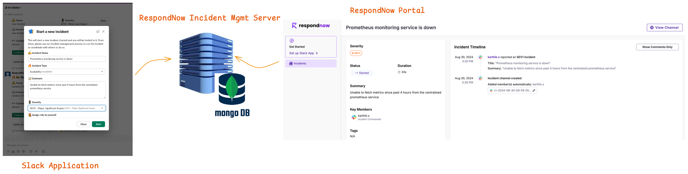

# Introduction

In the fast-paced world of modern IT operations, effective incident management is crucial to minimizing downtime and ensuring seamless service delivery. RespondNow is an open-source incident management framework designed to empower teams with a streamlined, customizable solution for handling incidents from start to finish.

RespondNow integrates seamlessly with Slack, enabling teams to interact with the framework through a dedicated chatbot/app. Whether you need to create, list, or update incidents, set up triage channels, or attach important artifacts like bug reports, tickets, or RCA documents, RespondNow makes it easy to manage every aspect of incident resolution directly within your team's communication hub.

Built with a cloud-native architecture, RespondNow is designed for scalability and reliability, and it is deployed on Kubernetes to ensure optimal performance in any environment. The framework is highly customizable and extendable, allowing organizations to tailor it to their specific workflows and operational needs.

## RespondNow Framework Components

RespondNow is built around three key components that work together to deliver a comprehensive incident management experience:

**Incident Management Server**: This is the core of RespondNow, responsible for processing and managing all incident-related data and operations. It provides the foundational backend that powers the entire framework.

**Slack App**: This is the primary interface for users. It allows teams to perform critical incident management tasks directly within their communication tool, making it easier to stay on top of incidents without switching contexts.

**Incident Dashboard**: This component offers a visual interface where users can monitor, manage, and gain insights into ongoing incidents. The portal provides a centralized view, enabling better coordination and decision-making throughout the incident lifecycle.

By bringing together powerful features and ease of use, RespondNow helps teams respond to incidents faster, collaborate more effectively, and maintain control over complex incident management processes.
